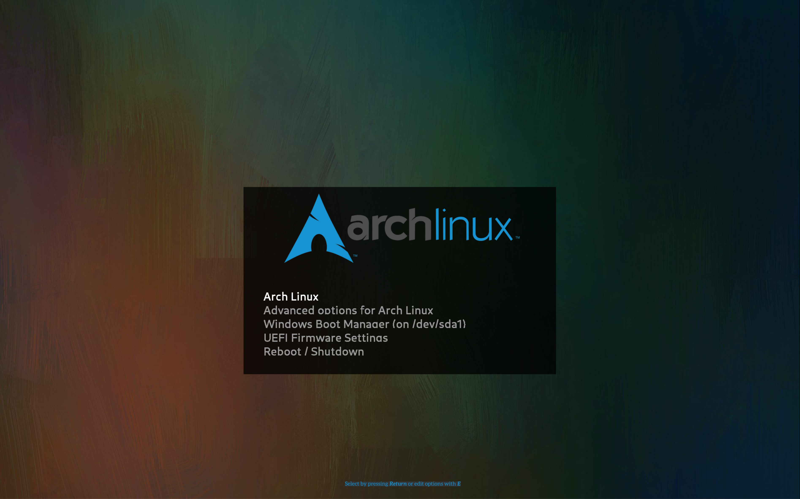

# Arch-blur GRUB2 theme

A GRUB2 theme, based on Arch-silence, that changes the fonts and logo, and adds a background 75% black filter. The default background is from GNOME, with thanks.

## License

If not explicitly stated otherwise all the files in this project are distributed under the [GNU General Public License](./COPYING).

## Author

Alexander Jacocks

based on Arch-silence, by Filippo Ghibellini
